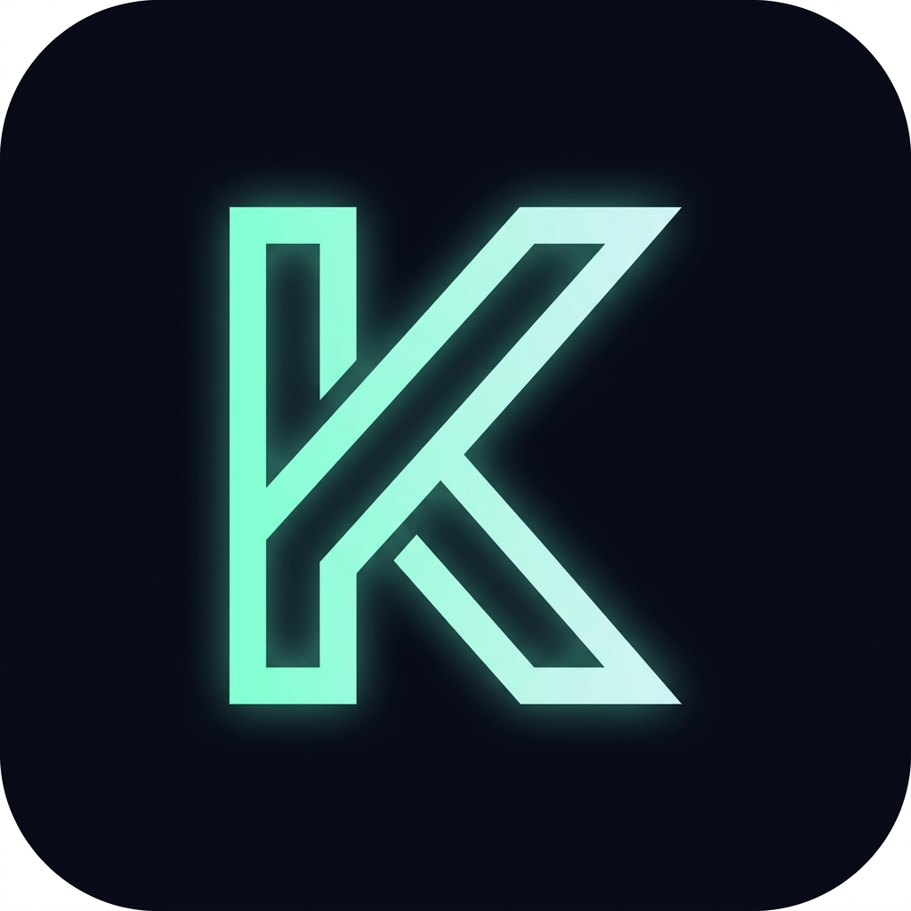
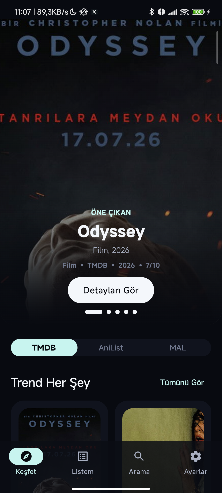

<div align="center">

  

  # 🎌 Kitsugi Beta

  **Android & Android TV için Gelişmiş AniList, Manga & Medya Takip Uygulaması**  
  *Advanced AniList, Manga & Media Tracker App for Android & Android TV*

  [](https://github.com/gameras1010-afk/Kitsugi-Beta/releases/latest)
  [](https://github.com/gameras1010-afk/Kitsugi-Beta)
  [](https://kotlinlang.org)
  [](LICENSE)

  <br />

  [🇹🇷 Türkçe Dokümantasyon](#-t%C3%BCrk%C3%A7e-dok%C3%BCmantasyon) • [🇬🇧 English Documentation](#-english-documentation)

</div>

---

# 🇹🇷 TÜRKÇE DOKÜMANTASYON

## 📱 Ekran Görüntüleri & Önizleme

<div align="center">
  
  <p><i>Kitsugi Modern Jetpack Compose Arayüzü & Medya Detay Sayfası</i></p>
</div>

---

## 🌟 Ana Özellikler

### 🎬 1. Çift Motorlu Medya Oynatıcı (Media3 + MPV)
- **Media3 & MPV Engine Integration**: Donanım ivmelendirmeli video oynatma, AV1, IAMF ve FFmpeg codec desteği.
- **ASS/SSA Altyazı Desteği**: `ass-media` kütüphanesi ile gelişmiş anime altyazı işleme.
- **Gain Audio Processor**: Düşük sesli yayınlarda otomatik ses yükseltme ve ekolayzır desteği.
- **Çoklu Ses & Altyazı Dil Seçimi**: Türkçe ve İngilizce öncelikli otomatik parça seçimi.

### 📖 2. Gelişmiş Manga & Webtoon Okuyucu
- **1300+ Kaynak Desteği**: Kotatsu-Redo, Mihon/Tachiyomi ve Cloudstream eklenti mimarisi entegrasyonu.
- **Dokunmatik Zoom & Akıcı Kaydırma**: Saket Telephoto `zoomable-image-coil` altyapısı ile pürüzsüz sayfa yakınlaştırma.
- **Webtoon & Manga Modları**: Dikey sonsuz kaydırma veya yatay sayfa çevirme seçenekleri.

### 🔄 3. Hesap Senkronizasyonu & Takip
- **AniList & MyAnimeList Entegrasyonu**: İzleme/okuma durumlarını ve bölüm sayılarını anlık otomatik güncelleme.
- **Simkl API 2.0 Desteği**: Gelişmiş medya takibi ve istatistik senkronizasyonu.
- **Air Date Bildirimleri**: Yeni çıkan anime bölümleri için otomatik yayın takvimi bildirimi.

### 📱 4. Hibrit Arayüz (Telefon + Android TV)
- **Jetpack Compose UI**: Glassmorphic tasarım, modern kart efektleri ve dinamik tema renkleri.
- **Android TV Desteği**: Kumanda (D-Pad) odaklı özel `ui/tv/` arayüzü ve TV Companion akış sunucusu.

### 🚀 5. Dahili Otomatik Güncelleme Sistemi
- **Canlı İndirme Çubuğu**: GitHub Releases API'si ile uygulama içinden tek tıkla güncelleme denetimi, indirme ilerleme yüzdesi ve otomatik paket kurulumu.

---

## 📥 İndirme ve Kurulum

1. **[Releases İndirme Sayfası](https://github.com/gameras1010-afk/Kitsugi-Beta/releases/latest)** adresine gidin.
2. `app-foss-debug.apk` veya `app-gms-debug.apk` dosyasını indirin.
3. Cihazınıza kurun *(Harici kaynaklardan yükleme iznini onaylayın)*.

---

## 🛠️ Mimari & Teknik Altyapı

```
app/src/main/java/com/kitsugi/animelist/
├── AppRoot.kt, AppNavigation.kt        # Jetpack Compose Ana Navigasyon Ağacı
├── core/
│   ├── diagnostics/                    # FileLoggingTree & Akış Hız Testi
│   ├── network/                        # OkHttp, DnsOverHttps, Cloudflare Bypass
│   ├── player/                         # Media3 + MPV Engine Selector, AssExtractor
│   └── update/                         # AppUpdateViewModel & GitHub Release Fetcher
├── data/
│   ├── auth/                           # OAuth 2.0 (AniList, MAL, Simkl)
│   ├── cloudstream/                    # Cloudstream Plugin Loader
│   ├── local/                          # Room Database v21 (KitsugiDatabase)
│   └── manga/                          # Mihon Shim & Kotatsu Extension Adapter
└── ui/
    ├── components/                     # KitsugiUpdateDialog, Shimmer, Dynamic Cards
    ├── screens/                        # Telefon Ekranları (Home, Detail, Player, Manga)
    └── tv/                             # Android TV D-Pad Arka Plan & UI Bileşenleri
```

---
---

# 🇬🇧 ENGLISH DOCUMENTATION

## 📱 Screenshots & Preview

<div align="center">
  
  <p><i>Kitsugi Modern Jetpack Compose UI & Media Details Page</i></p>
</div>

---

## 🌟 Key Features

### 🎬 1. Dual-Engine Video Player (Media3 + MPV)
- **Media3 & MPV Engine Integration**: Hardware-accelerated video playback with native support for AV1, IAMF, and FFmpeg codecs.
- **Advanced ASS/SSA Subtitles**: Rich styled subtitle rendering via `ass-media` library.
- **Gain Audio Processor**: Built-in volume gain boosting and dynamic equalizer.
- **Multi-Track Selection**: Auto-selection of preferred audio and subtitle languages (TR & EN prioritized).

### 📖 2. Advanced Manga & Webtoon Reader
- **1300+ Sources**: Unified extension layer for Kotatsu-Redo, Mihon/Tachiyomi, and Cloudstream providers.
- **Pinch-to-Zoom & Smooth Scroll**: Powered by Saket Telephoto `zoomable-image-coil` architecture.
- **Webtoon & Manga Modes**: Supports continuous vertical scrolling and classic horizontal paging.

### 🔄 3. Account Synchronization & Tracking
- **AniList & MyAnimeList OAuth**: Real-time watch/read list updates and episode tracking.
- **Simkl API 2.0 Integration**: In-depth media analytics and watch statistics.
- **Airing Calendar Notifications**: Timely notifications for upcoming anime episodes.

### 📱 4. Hybrid Interface (Phone + Android TV)
- **Jetpack Compose UI**: Glassmorphic styling, modern motion tokens, and adaptive color palettes.
- **Android TV Native Support**: Fully D-Pad navigable UI with dedicated `ui/tv/` components and companion server.

### 🚀 5. Built-in Auto-Update System
- **Real-Time Progress Bar**: In-app one-tap update check via GitHub Releases API with live byte progress and package installer trigger.

---

## 📥 Download & Installation

1. Visit the **[Latest Release Download Page](https://github.com/gameras1010-afk/Kitsugi-Beta/releases/latest)**.
2. Download `app-foss-debug.apk` or `app-gms-debug.apk`.
3. Install the APK on your device *(Enable installation from unknown sources if prompted)*.

---

## 📄 License

Distributed under the **BSD 3-Clause License**. See `LICENSE` for details.

<div align="center">
  <sub>Kitsugi Open Source Project • Built with ❤️ for Anime & Manga Enthusiasts Worldwide</sub>
</div>
